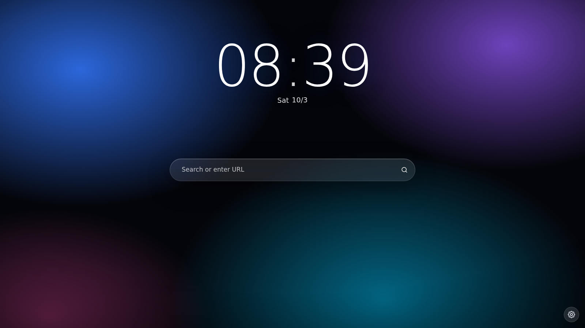

# Floorp Modern

**A redesign for [Floorp](https://floorp.app), Firefox and Firefox forks on Windows — six themes, a setup window to customize them, and a reworked built-in PDF viewer.**

Supported browsers: Floorp, Firefox, Firefox Developer Edition, Firefox Nightly, LibreWolf, Waterfox, Zen Browser, Mercury.

[Русская версия ниже](#русский) · Version **1.8.0** · [Changelog](CHANGELOG.md)



## Features

**Six themes** — pick one in the installer:
- **One UI** — Samsung Galaxy look, accent color from Windows.
- **Material You** — Android / Pixel: tonal colors from the accent, stacked lock-screen clock.
- **Windows 11** — Fluent: crisp corners, accent underline, Bloom wallpaper.
- **macOS** — traffic-light window buttons, blue menus, wave wallpaper.
- **Nothing** — monochrome, red dot, dot-matrix clock.
- **iOS · Liquid Glass** — iOS 26 look: a wallpaper behind the window, a floating glass toolbar capsule, glass tabs, menus and toasts with highlights, square app icons, green switches, a glass lock-screen clock, and a PDF toolbar that floats over the pages.

**Interface**
- Turns on Firefox's new **Nova** design as a base (and replaces Floorp's old *Lepton* skin with *Proton*).
- One UI 8.5 look: round buttons, pill-shaped tabs, bookmarks and address bar, large rounded cards.
- Pure black background in dark mode, the web page sits in a floating rounded card.
- **Accent color follows Windows** (Settings → Personalization → Colors).
- Main menu items get **colored round icons**, like Galaxy settings.
- Menus, address-bar suggestions, downloads, extensions, permission panels, bookmarks/history sidebars — all restyled.
- Firefox and Floorp settings pages, add-ons page: black background, big cards, pill buttons, accent toggles.
- Soft accent ring around the address bar.
- **New tab page like a Galaxy lock screen** (Floorp only): huge thin clock, pill search, animated “aurora” background in your accent color.

**New features**
- Page-load progress line under the toolbar.
- `Alt+Shift+C` copies the current page address (with a toast).
- “Downloaded: file” toast when a download finishes.
- Theme button on the toolbar: Auto / Light / Dark in one click.
- **Now Bar**: music playing in another tab shows a small draggable bar with previous/next, pause, mute and “go to tab”.
- Toasts for page zoom and tab mute.
- `Alt+Shift+D` closes duplicate tabs, `Alt+Shift+Z` toggles focus mode (hides bookmarks and sidebars).
- Address centered while not editing, springy menus and buttons.
- Smooth fade when switching tabs.
- Tabs sidebar expands on hover.

**PDF viewer**
- New toolbar: grouped pill buttons, new icons.
- Theme button: UI Auto / Light / Dark, pages Auto / Paper / Sepia / Night.
- **Edge-style ink**: drawings have no selection frame; you grab a drawing only by its strokes and can keep drawing right next to it.
- Reopens each PDF on the page where you left off.
- Page bookmarks: ribbon button with a list per file, `Ctrl+B` toggles the current page.
- Quick text: click a “……” gap or double-click an empty spot and start typing.
- Own color palette instead of the Windows color dialog.

## Requirements

- Windows 10/11
- Floorp 12 (Firefox 156 based) and/or Firefox 156+. Built and tested on Floorp 12.18 / Firefox 156; other versions may need tweaks.
- Administrator rights once, to put a small script loader into the browser folder.
- Built-in theme **“System theme — auto”** enabled (third-party themes repaint the window frame).

## Install

1. Download the repository (`Code → Download ZIP`) and unzip it.
2. Double-click **`Setup.cmd`** and allow administrator rights.
3. In the window pick the theme (**One UI** or **iOS · Liquid Glass**), switch on **Floorp**, **Firefox** or both, and choose whether to install the **new PDF viewer**.
4. Press **Install**. If the browser is open, the installer asks you to close it.
5. Start the browser.

On Windows 11 the setup window itself is frosted glass. Prefer a console? `install.cmd` does the same with text prompts.

If Windows SmartScreen appears: *More info → Run anyway*.

## Uninstall

Run **`Setup.cmd`** → *Remove theme* (or `uninstall.cmd`). Your previous Floorp design, the stock PDF viewer and default Firefox settings come back after a restart. Your own `userChrome.css` / `userContent.css` rules are never touched; backups are kept as `*.bak-floorp-modern`.

## What goes where

| Location | Files | Purpose |
|---|---|---|
| Browser folder (e.g. `C:\Program Files\Ablaze Floorp`, `C:\Program Files\Mozilla Firefox`) | `config.js`, `defaults\pref\config-prefs.js` | Autoconfig loader for the scripts |
| Profile `chrome\userChrome.css` | block `FLOORP-MODERN` | Browser UI |
| Profile `chrome\userContent.css` | blocks `FLOORP-MODERN`, `PDF-TWEAKS` | about: pages, settings, new tab, PDF viewer |
| Profile `chrome\pdf-tweaks\` | `*.mjs`, `floorp-modern.uc.js` | PDF viewer actor, window features |
| Profile `user.js` | a few prefs | Enables userChrome, Nova, expand-on-hover |

## Customize

- Accent, corner radius, spacing: the **«НАСТРОЙКИ» / settings** block at the top of `FLOORP-MODERN` in `userChrome.css`.
- PDF ink behavior: top of `chrome\pdf-tweaks\FloorpPdfTweaksChild.sys.mjs` (`IDLE_MS`, `GAP_PX`, `GRAB_PX`).
- Reinstalling overwrites these blocks.

## After a browser update

A major update may remove the loader from the program folder. If the theme button or the PDF features disappear, just run `Setup.cmd` again.

## Development

CSS is generated by the scripts in `tools/`:

```sh
cd tools
python3 gen_chrome.py ../files        # floorp-modern-chrome.css, floorp-modern-content.css
python3 gen_css.py > ../files/pdf-viewer-theme.css
python3 gen_ios.py ../files/themes     # iOS overlays (inserted before the END markers)
```

Window features log to `chrome\pdf-tweaks\fm-log.json` and `fm-boot.json` in the profile — handy for debugging.

## Disclaimer

This is an unofficial community mod. It is not affiliated with or endorsed by Mozilla or Ablaze (Floorp). It uses the browser's documented customization mechanisms (`userChrome.css`, `userContent.css`, AutoConfig). Use at your own risk.

## License

[MIT](LICENSE)

---

## Русский

**Редизайн Floorp, Firefox и форков Firefox для Windows: шесть тем, настройка перед установкой и переделанный встроенный просмотрщик PDF.**

Поддерживаются: Floorp, Firefox, Firefox Developer Edition, Firefox Nightly, LibreWolf, Waterfox, Zen Browser, Mercury.

**Шесть тем** на выбор в установщике:
- **One UI**: как Samsung Galaxy, акцент из Windows.
- **Material You**: как Android / Pixel, тональные цвета, часы столбиком.
- **Windows 11**: Fluent, строгие углы, обои Bloom.
- **macOS**: «светофор» вместо кнопок окна, синие меню, обои-волны.
- **Nothing**: монохром, красная точка, часы из точек.
- **iOS · Liquid Glass**: как iOS 26. Обои под окном, парящая стеклянная панель, стеклянные вкладки, меню и уведомления с бликами, иконки-квадраты, зелёные переключатели, стеклянные часы, панель PDF поверх страниц.

### Что меняется

**Интерфейс**
- В основе новый дизайн Firefox **Nova**. Старый дизайн Floorp *Lepton* заменяется на *Proton*.
- Стиль One UI 8.5: круглые кнопки, вкладки, закладки и адресная строка в форме «таблеток», крупные скругления.
- В тёмной теме чистый чёрный фон, а страница в «плавающей» скруглённой карточке.
- **Цвет акцента берётся из Windows** (Параметры → Персонализация → Цвета).
- Пункты главного меню с **цветными круглыми иконками**, как в настройках Galaxy.
- Меню, подсказки адресной строки, загрузки, расширения, панели разрешений, боковые панели закладок и журнала оформлены в одном стиле.
- Настройки Firefox и Floorp и страница дополнений: чёрный фон, большие карточки, кнопки-«таблетки», переключатели в цвете акцента.
- Мягкая обводка цветом акцента вокруг адресной строки.
- **Стартовая страница как экран блокировки Galaxy** (только Floorp): огромные часы, поиск-«таблетка», живой фон-«аврора».

**Новые функции**
- Полоска загрузки страницы под панелью.
- `Alt+Shift+C` копирует адрес страницы.
- Уведомление «Загружено: файл».
- Кнопка темы на панели: Авто, Светлая или Тёмная.
- **Now Bar**: если музыка играет в другой вкладке, появляется плашка с кнопками назад/вперёд, паузой и звуком; её можно перетаскивать.
- Уведомления о масштабе страницы и выключенном звуке.
- `Alt+Shift+D` закрывает одинаковые вкладки, `Alt+Shift+Z` включает режим фокуса.
- Адрес по центру, «пружинящие» меню и кнопки.
- Плавное появление страницы при смене вкладки.
- Панель вкладок раскрывается при наведении.

**Просмотрщик PDF**
- Новая панель и иконки.
- Кнопка темы: интерфейс и цвет страниц (бумага, сепия, ночь).
- **Рисование как в Edge**: у рисунка нет рамки, хватается он только за линии, рядом можно рисовать дальше.
- PDF открывается на той странице, где вы остановились.
- Закладки страниц: кнопка-ленточка со списком для каждого файла, `Ctrl+B` — закладка на текущей странице.
- Быстрый текст: клик по пропуску «……» или двойной клик по пустому месту — и сразу печатаете.
- Своя палитра цветов вместо системного окна Windows.

### Установка

1. Скачайте репозиторий (`Code → Download ZIP`) и распакуйте.
2. Запустите **`Setup.cmd`** и разрешите права администратора.
3. В окне выберите тему (**One UI** или **iOS · Liquid Glass**), включите **Floorp**, **Firefox** или оба и решите, ставить ли **новый просмотрщик PDF**.
4. Нажмите **Установить** и откройте браузер.

Консольный вариант: `install.cmd`.

Тема браузера должна быть встроенной: **«Системная тема — авто»**.

### Удаление

**`Setup.cmd`** → «Удалить оформление» (или `uninstall.cmd`). Ваши собственные стили не трогаются.

### После обновления браузера

Если пропали кнопка темы или функции PDF, запустите `Setup.cmd` ещё раз.

Неофициальный мод, не связан с Mozilla и Ablaze. Используйте на свой страх и риск. Лицензия MIT.
